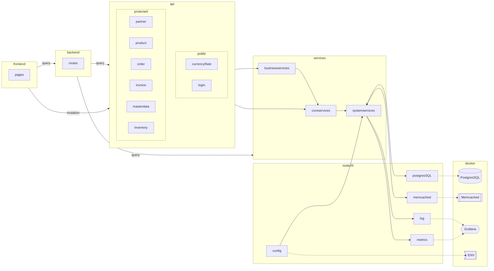

# segmentcontroller ERP

```mermaid
flowchart LR

    subgraph nodeJS
        postgresSQL
        memcached
        log
        config
        metrics
    end

    subgraph docker
        bitnami-PG[(PostgresSQL)]
        bitnami-memcached[[Memcached]]
        bitnami-grafana{{Grafana}}
        ENV>ENV]
    end
    postgresSQL -.-> bitnami-PG
    memcached -.-> bitnami-memcached
    log -.-> bitnami-grafana
    config  -.-> ENV
    metrics -.-> bitnami-grafana

    subgraph services
        coreservices
        systemservices
        businessservices
        businessservices --> coreservices --> systemservices

        config ---> systemservices
        systemservices <---> postgresSQL & memcached
        systemservices ---> log & metrics
    end

    subgraph api
        subgraph public
            currencyRate
            login
        end
        subgraph protected
            partner
            product
            order
            invoice
            masterdata
            inventory
        end
    end
    api --> coreservices
    api --> businessservices

    subgraph backend
        routes
    end
    backend --query--> api
    backend --query--> services

    subgraph frontend
        pages
    end
    frontend --query--> backend
    frontend --mutation--> api

```
